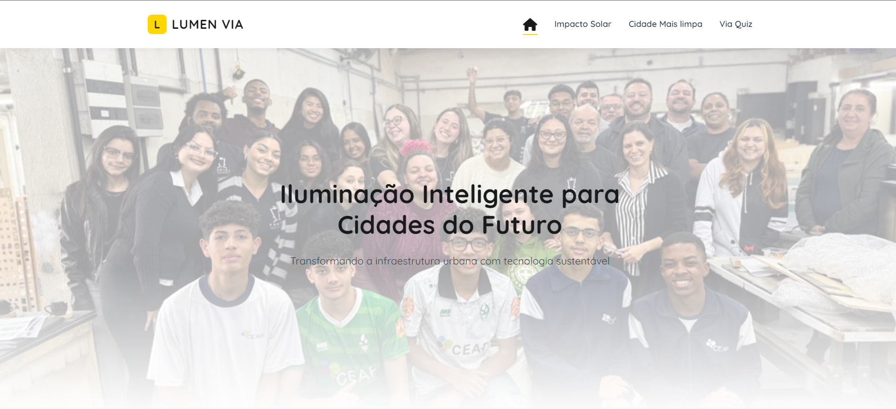

# 🌿 Lumen Via - Iluminação Inteligente para Cidades do Futuro

[Lumen Via](https://lumen-via.vercel.app) é uma plataforma inovadora que une **sustentabilidade** e **tecnologia** para transformar a mobilidade urbana e otimizar a manutenção de vias. Nosso foco é reduzir custos, melhorar a eficiência e diminuir as emissões de CO₂ nas cidades.

---

## 🖼️ Pré-visualização

_Aqui você pode inserir um print da tela inicial do projeto:_  

---

## 🚀 Funcionalidades Principais

- ☀️ **Impacto Solar**  
  Aproveitamento de energia limpa para reduzir impactos ambientais e custos de manutenção.

- 🌱 **Cidade Mais Limpa**  
  Ferramentas que incentivam práticas sustentáveis no espaço urbano.

- 🎯 **Via Quiz**  
  Um quiz interativo para promover a consciência ambiental e boas práticas de mobilidade.
---

## 💻 Tecnologias Utilizadas

- HTML5,
-  CSS3,
-  JavaScript 

---

## ⏳ Como Usar

Acesse o projeto diretamente no navegador:  
👉 [lumen-via.vercel.app](https://lumen-via.vercel.app)

---

## 📄 Licença

Este projeto está licenciado sob a licença MIT. Consulte o arquivo `LICENSE` para mais detalhes.

---

## 📬 Contato

Para dúvidas, sugestões ou parcerias:  
✉️ contatogobato@gmail.com  

---

🌟 **Lumen Via — cidades mais inteligentes, seguras e sustentáveis.**
